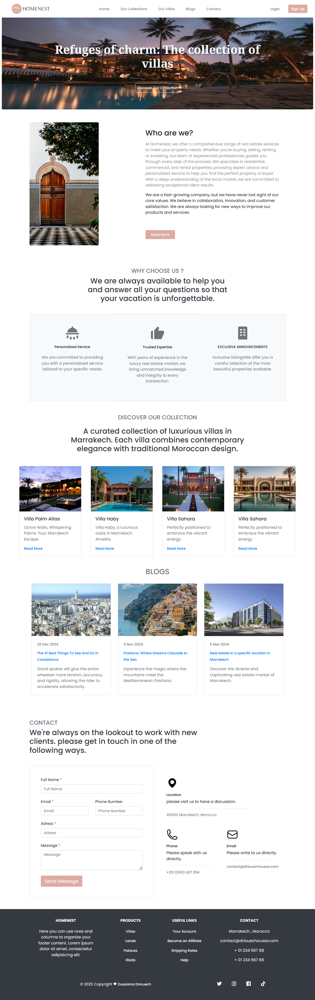

# 🏡 Homenest – Property Booking Landing Page

Welcome to **Homenest**, a responsive and elegant landing page built to help property owners, travel agencies, and booking platforms convert visitors into happy guests. Whether you’re advertising beachside villas or countryside cabins, this landing page brings your properties to life.

## ✨ Features

- 🎯 **Conversion-Focused Design** – Eye-catching layout with strong call-to-action
- 📱 **Responsive Layout** – Optimized for mobile, tablet, and desktop
- 🌐 **Clean & Minimal UI** – Professional and modern aesthetic
- 🚀 **Fast & Lightweight** – Built with performance in mind


## 📸 Preview

  

## 🛠️ Tech Stack

- HTML5  
- CSS3
- JavaScript   
- Bootstrap 5
- Figma
- [boxicons](https://boxicons.com/)
- [Google Fonts](https://fonts.google.com/)


## 📂 Project Structure

```bash
.
├── index.html
├── /assets
│   ├── /images
│   └── /css
│       └── style.css
├── /js
│   └── main.js
└── README.md

```
## 🚀 Getting Started

Follow these simple steps to set up the landing page locally:

### 1. Clone the Repository

Open your terminal and run:

```bash
git clone https://github.com/driouechoussa/homenest.git
```

Replace `yourusername` with your actual GitHub username.

### 2. Navigate to the Project Folder

```bash
cd homenest
```

### 3. Open the Project in Your Browser

You can simply open the `index.html` file in your browser:

- On **Windows**:  
  Right-click `index.html` → Open with → Your browser

- On **macOS/Linux**:  
  Use this command:  
  ```bash
  open index.html
  ```


